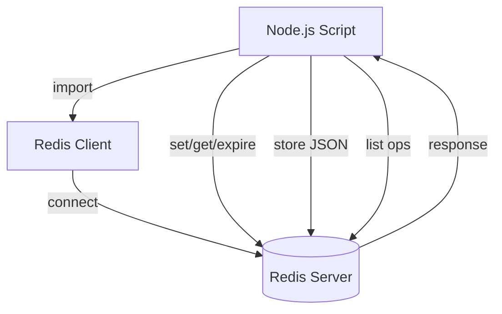

# Redis Playground

A simple Node.js playground to learn and experiment with Redis data structures and commands.

---

## Index

1. [Overview](#overview)
2. [Architecture Diagram](#architecture-diagram)
3. [Setup & Installation](#setup--installation)
4. [Usage](#usage)
5. [Concepts Covered](#concepts-covered)
    - [String Operations](#string-operations)
    - [Key Expiry](#key-expiry)
    - [Storing JSON Data](#storing-json-data)
    - [List Operations](#list-operations)
6. [Code Structure](#code-structure)
7. [Further Reading](#further-reading)

---

## Overview

This project demonstrates basic Redis operations using Node.js. It covers connecting to Redis, setting and getting string values, expiring keys, storing JSON objects, and working with Redis lists.

---

## Architecture Diagram



---

## Setup & Installation

1. **Clone the repository:**
    ```sh
    git clone <your-repo-url>
    cd redis-playground
    ```

2. **Install dependencies:**
    ```sh
    npm install
    ```

3. **Ensure Redis is running locally:**
    - Default connection: `redis://localhost:6379`
    - [Download Redis](https://redis.io/download)

---

## Usage

- **Run the main script:**
    ```sh
    node script.js
    ```

- **Run the list demo:**
    ```sh
    node list.js
    ```

- The scripts will:
    - Connect to Redis
    - Store a user object as JSON
    - Set expiry on keys
    - Retrieve and log values
    - Demonstrate list operations (push, pop, length)

---

## Concepts Covered

### String Operations

- **Set a key-value pair:**
    ```js
    await client.set('msg:1', 'Hello from Redis!');
    ```
- **Get a value:**
    ```js
    const value = await client.get('msg:1');
    ```

### Key Expiry

- **Expire a key after N seconds:**
    ```js
    await client.expire('msg:1', 10);
    ```

### Storing JSON Data

- **Store an object as JSON:**
    ```js
    await client.set('user:3', JSON.stringify({ name: "Max", age: 30 }));
    ```
- **Retrieve and parse:**
    ```js
    const user = JSON.parse(await client.get('user:3'));
    ```

### List Operations

- [Redis List Documentation](https://redis.io/docs/latest/develop/data-types/lists/)

- **Add elements to a list:**
    ```js
    await client.lPush("tasks", "NodeJS"); // Push to left
    await client.rPush("tasks", "ReactJS"); // Push to right
    ```
- **Remove elements from a list:**
    ```js
    await client.lPop("tasks"); // Pop from left
    await client.rPop("tasks"); // Pop from right
    ```
- **Get length of a list:**
    ```js
    const length = await client.lLen("tasks");
    ```
- **Other useful commands:**
    - `lRange(key, start, stop)` - Get elements in a range
    - `lIndex(key, index)` - Get element by index

---

## Code Structure

- `client.js`  
  Initializes and exports the Redis client.

- `script.js`  
  Demonstrates Redis operations (set, get, expire, store JSON).

- `list.js`  
  Demonstrates Redis list operations (push, pop, length).

- `package.json`  
  Project metadata and dependencies.

---

## Further Reading

- [Redis Official Documentation](https://redis.io/documentation)
- [Node.js Redis Client](https://github.com/redis/node-redis)
- [Redis List Data Type](https://redis.io/docs/latest/develop/data-types/lists/)
- [Mermaid Diagrams](https://mermaid-js.github.io/mermaid/#/)

---

**Happy Learning Redis!**