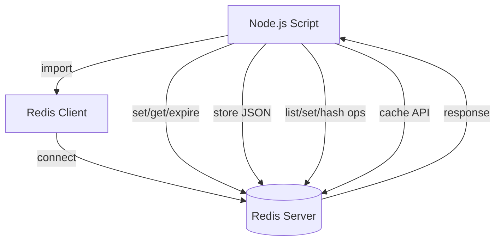
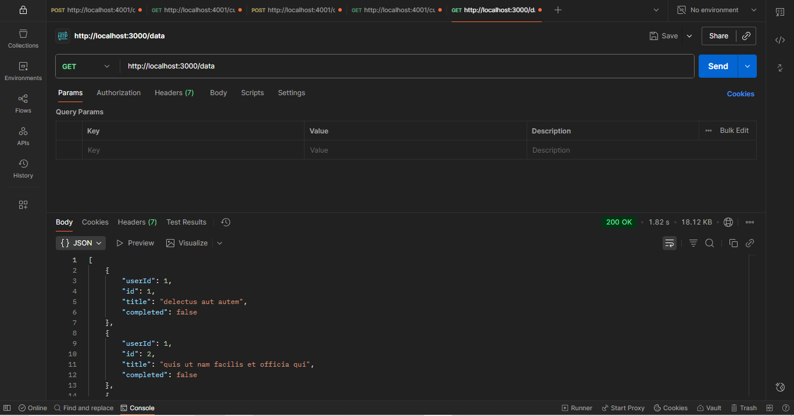
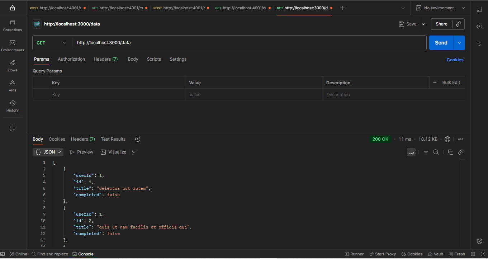

# Redis Playground

A simple Node.js playground to learn and experiment with Redis data structures and commands.

---

## Index

1. [Overview](#overview)
2. [Architecture Diagram](#architecture-diagram)
3. [Setup & Installation](#setup--installation)
4. [Usage](#usage)
5. [Concepts Covered](#concepts-covered)
    - [String Operations](#string-operations)
    - [Key Expiry](#key-expiry)
    - [Storing JSON Data](#storing-json-data)
    - [List Operations](#list-operations)
    - [Set Operations](#set-operations)
    - [Hash Operations](#hash-operations)
    - [Caching with Redis](#caching-with-redis)
6. [Code Structure](#code-structure)
7. [Further Reading](#further-reading)

---

## Overview

This project demonstrates basic Redis operations using Node.js. It covers connecting to Redis, setting and getting string values, expiring keys, storing JSON objects, working with Redis lists, sets, hashes, and using Redis for caching API responses.

---

## Architecture Diagram



---

## Before & After Redis

**Before using Redis (Direct API call):**



**After using Redis (API response cached):**



---

## Setup & Installation

1. **Clone the repository:**
    ```sh
    git clone <your-repo-url>
    cd redis-playground
    ```

2. **Install dependencies:**
    ```sh
    npm install
    ```

3. **Ensure Redis is running locally:**
    - Default connection: `redis://localhost:6379`
    - [Download Redis](https://redis.io/download)

---

## Usage

- **Run the main script:**
    ```sh
    node script.js
    ```

- **Run the list demo:**
    ```sh
    node list.js
    ```

- **Run the set demo:**
    ```sh
    node sets.js
    ```

- **Run the hash demo:**
    ```sh
    node hash.js
    ```

- **Run the caching API server:**
    ```sh
    node Redis_project.js
    ```
    - Visit [http://localhost:3000/data](http://localhost:3000/data) in your browser.

---

## Concepts Covered

### String Operations

- **Set a key-value pair:**
    ```js
    await client.set('msg:1', 'Hello from Redis!');
    ```
- **Get a value:**
    ```js
    const value = await client.get('msg:1');
    ```

### Key Expiry

- **Expire a key after N seconds:**
    ```js
    await client.expire('msg:1', 10);
    ```

### Storing JSON Data

- **Store an object as JSON:**
    ```js
    await client.set('user:3', JSON.stringify({ name: "Max", age: 30 }));
    ```
- **Retrieve and parse:**
    ```js
    const user = JSON.parse(await client.get('user:3'));
    ```

### List Operations

- [Redis List Documentation](https://redis.io/docs/latest/develop/data-types/lists/)

- **Add elements to a list:**
    ```js
    await client.lPush("tasks", "NodeJS"); // Push to left
    await client.rPush("tasks", "ReactJS"); // Push to right
    ```
- **Remove elements from a list:**
    ```js
    await client.lPop("tasks"); // Pop from left
    await client.rPop("tasks"); // Pop from right
    ```
- **Get length of a list:**
    ```js
    const length = await client.lLen("tasks");
    ```
- **Other useful commands:**
    - `lRange(key, start, stop)` - Get elements in a range
    - `lIndex(key, index)` - Get element by index

### Set Operations

- [Redis Set Documentation](https://redis.io/docs/latest/develop/data-types/sets/)

- **Add members to a set:**
    ```js
    await client.sAdd("fruits", "Watermelon");
    ```
- **Remove a member from the set:**
    ```js
    await client.sRem("fruits", "orange");
    ```
- **Check if an element is a member:**
    ```js
    const result = await client.sIsMember("fruits", "oranges");
    ```

### Hash Operations

- [Redis Hash Documentation](https://redis.io/docs/latest/develop/data-types/hashes/)

- **Add fields to a hash:**
    ```js
    await client.hSet("player:1", { name: "Piyush", age: "26", city: "New York", carName: "BMW" });
    ```
- **Access a field from the hash:**
    ```js
    const name = await client.hGet("player:1", "name");
    ```
- **Remove a field from the hash:**
    ```js
    await client.hDel("player:1", "age");
    ```

### Caching with Redis

- [Redis Caching Documentation](https://redis.io/docs/latest/develop/use-cases/caching/)

- **Cache API response with expiry:**
    ```js
    // Check cache
    const cachedData = await client.get('externalData');
    if (cachedData) {
        return res.json(JSON.parse(cachedData));
    }
    // Fetch and cache
    const response = await axios.get('https://jsonplaceholder.typicode.com/todos');
    await client.setEx('externalData', 3600, JSON.stringify(response.data));
    ```

---

## Code Structure

- `client.js`  
  Initializes and exports the Redis client.

- `script.js`  
  Demonstrates Redis operations (set, get, expire, store JSON).

- `list.js`  
  Demonstrates Redis list operations (push, pop, length).

- `sets.js`  
  Demonstrates Redis set operations (add, remove, check membership).

- `hash.js`  
  Demonstrates Redis hash operations (add, get, delete fields).

- `Redis_project.js`  
  Express server showing Redis caching for API responses.

- `package.json`  
  Project metadata and dependencies.

- `assets/`  
  Contains images for before/after Redis usage.

---

## Further Reading

- [Redis Official Documentation](https://redis.io/documentation)
- [Node.js Redis Client](https://github.com/redis/node-redis)
- [Redis List Data Type](https://redis.io/docs/latest/develop/data-types/lists/)
- [Redis Set Data Type](https://redis.io/docs/latest/develop/data-types/sets/)
- [Redis Hash Data Type](https://redis.io/docs/latest/develop/data-types/hashes/)
- [Redis Caching Use Case](https://redis.io/docs/latest/develop/use-cases/caching/)
- [Mermaid Diagrams](https://mermaid-js.github.io/mermaid/#/)

---

**Happy Learning Redis!**